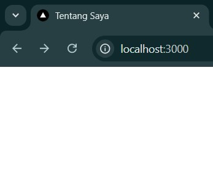
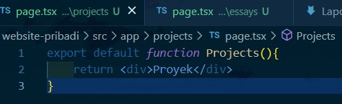
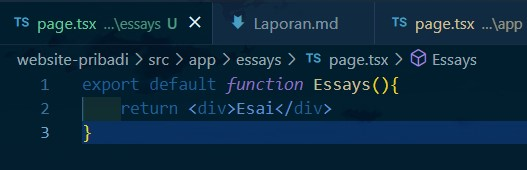
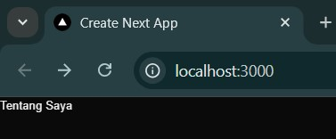
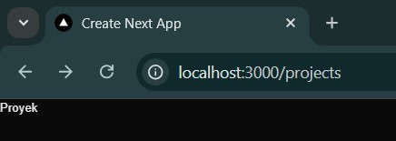
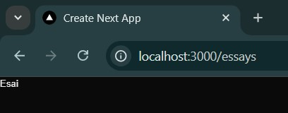
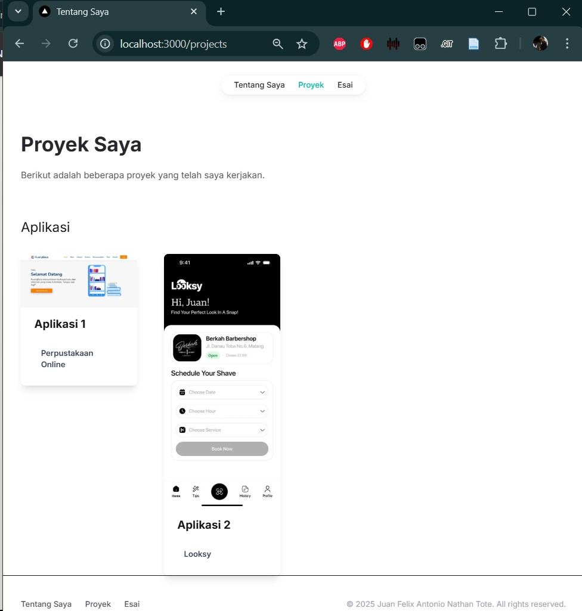

# Week 01 - PENGANTAR PEMROGRAMAN BERBASIS FRAMEWORK DAN REACTJS

**Nama :** Juan Felix Antonio Nathan Tote<br>
**NIM :** 2241720042<br>
**Kelas :** TI-3B<br>
**Absen :** 16

##  Praktikum 1: Menyiapkan Lingkungan Pengembangan
### Instalasi Git


### Instalasi VS Code


### Instalasi NodeJS 
zzzz

### Pertanyaan Praktikum 1 
1. Jelaskan kegunaan masing-masing dari Git, VS Code dan NodeJS yang telah Anda install pada sesi praktikum ini! 
> Git adalah alat software development yang digunakan untuk menyimpan, mengelola, dan berbagai source code 
<br>
> Vs Code adalah software yang berfungsi untuk menuliskan kode program dan membangun aplikasi 
<br>
> NodeJS adalah platform berbasis JavaScript yang digunakan untuk mengembangkan aplikasi web
2. Buktikan dengan screenshoot yang menunjukkan bahwa masing-masing tools tersebut
telah berhasil terinstall di perangkat Anda! 
> ### [Instalasi Git](#instalasi-git)
> ### [Instalasi VS Code](#instalasi-vs-code)
> ### [Instalasi NodeJS](#instalasi-nodejs)

## Praktikum 2: Membuat Proyek Pertama React Menggunakan Next.js 



Running proyek hello-world dengan memasukkan perintah di bawah ini melalui konsol atau terminal di dalam VS Code




### Pertanyaan Praktikum 2
1. Pada Langkah ke-2, setelah membuat proyek baru menggunakan Next.js, terdapat beberapa istilah yang muncul. Jelaskan istilah tersebut, TypeScript, ESLint, Tailwind CSS, App Router, Import alias, dan Turbopack! 
> TypeScript adalah bahasa pemrograman berbasis JavaScript dengan fitur static typing, membuat kode lebih aman dan terstruktur.
<br>
> Eslint adalah alat untuk mengecek dan memperbaiki kesalahan dalam kode JavaScript/TypeScript.
<br>
> Tailwind CSS adalah framework CSS berbasis utility-first yang memudahkan styling tanpa perlu menulis banyak CSS.
<br>
> App Router sistem routing baru di Next.js yang menggunakan folder app/, mendukung server components untuk performa lebih baik.
<br>
> Import alias adalah fitur di JavaScript/TypeScript yang memungkinkan pengembang menggunakan jalur (path) yang lebih pendek dan mudah dibaca saat mengimpor file.
<br>
> Turbopack adalah bundler baru yang dikembangkan oleh Vercel (pembuat Next.js) untuk menggantikan Webpack dan meningkatkan kecepatan pengembangan.

2. Apa saja kegunaak folder dan file yang ada pada struktur proyek React yang tampil pada gambar pada tahap percobaan ke-3! 
> a. Folder .next/ 
<br>
Folder hasil build yang dibuat oleh Next.js.
<br>
> b. Folder node_modules/
<br>
Folder tempat semua dependensi
<br>
> c. Folder public/
<br>
Menyimpan file statis seperti gambar, favicon, atau file lainnya.
<br>
> d. Folder src/app/
<br>
Folder utama untuk manajemen halaman di Next.js.
<br>
> e. File .gitignore 
<br>
Menentukan file atau folder yang harus diabaikan oleh Git, seperti node_modules/ dan .next/
<br>
> f. File eslint.config.mjs
<br>
Konfigurasi ESLint untuk memastikan kode JavaScript/TypeScript tetap bersih dan bebas dari bug.
<br>
> g. File next-env.d.ts
<br>
File deklarasi TypeScript yang dibuat otomatis oleh Next.js untuk dukungan TypeScript.
<br>
> h. File next.config.ts
<br>
File konfigurasi untuk Next.js, misalnya untuk mengatur basePath, i18n, webpack, dll.
<br>
> i. File package-lock.json
<br>
Menyimpan daftar dependensi proyek dan skrip yang bisa dijalankan (npm run dev, dll.).
<br>
> j. File package.json
Menyimpan versi pasti dari paket yang di-install untuk memastikan konsistensi.
<br>
> k. File postcss.config.mjs
<br>
Konfigurasi PostCSS, sering digunakan untuk mengelola Tailwind CSS atau CSS otomatis lainnya.
<br>
> l. File README.md
<br>
Dokumentasi proyek.
<br>
> m. File tailwind.config.js
<br>
Konfigurasi untuk Tailwind CSS, seperti pengaturan warna, font, dan kustomisasi lainnya.
<br>
> n. File tsconfig.json
<br>
Konfigurasi TypeScript, menentukan aturan seperti strict mode, paths alias, dll.
3. Buktikan dengan screenshoot yang menunjukkan bahwa tahapan percobaan di atas telahberhasil Anda lakukan! 
### [Membuat Proyek Pertama React Menggunakan Next.js](#praktikum-2-membuat-proyek-pertama-react-menggunakan-nextjs)


## Praktikum 3: Menambahkan Komponen React (Button)
1. Di dalam folder proyek yang telah dibuka di VS Code, buka file page.tsx
2.Tambahkan fungsi MyButton yang mengembalikan markup komponen button yang akan
ditambahkan ke dalam webpage 
```jsx
function MyButton() {
  return (
    <a 
      href="http://localhost:3000"
      target="_blank" 
      rel="noopener noreferrer"
      className="px-4 py-2 bg-blue-500 text-white rounded-lg hover:bg-blue-600 transition duration-300"
    >
      Buka Halaman
    </a>
  );
}
```
3. Tambahkan komponen button tersebut di samping button Read Our Docs.  


### Pertanyaan Praktikum 3
1. Buktikan dengan screenshoot yang menunjukkan bahwa tahapan percobaan di atas telah
berhasil Anda lakukan! 


## Praktikum 4: Menulis Markup dengan JSX 
1. Tambahkan kode JSX di bawah ini ke dalam file page.tsx. 

```jsx
function Profile() {
  return (
    <>
      <div className="text-xs">Developed by: {user.name}</div>
      
    </>
  );
}

const user = {
  name: 'Fulanah bin Fulan',
  imageUrl: 'https://i.imgur.com/yXOvdOSs.jpg',
  imageSize: 90,
};

```
2. Tambahkan komponen MyProfile setelah kompnen MyButton. 


### Pertanyaan Praktikum 4
1. Untuk apakah kegunaan sintaks user.imageUrl?
> Sintaks user.imageUrl digunakan untuk mengambil alamat URL gambar yang terkait dengan pengguna. Misalnya, jika ada pengguna yang memiliki gambar profil, user.imageUrl akan memberikan alamat gambar tersebut, seperti link ke foto profil pengguna
2. Buktikan dengan screenshoot yang menunjukkan bahwa tahapan percobaan di atas telah berhasil Anda lakukan! 
